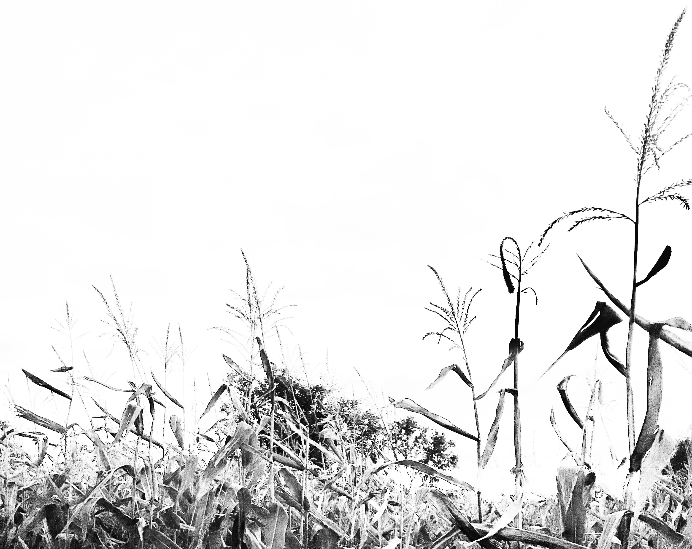

# 👋 Hi, I’m @giranjbaramir

- 🌍 Hailing from Shiraz, and currently based in Kingston 📍.
- 🎓 Loyalist CVI '19 alum, and Queen’s University '24 graduate.
- 🧬 Learning the ropes of bioinformatics.
- 🧪 My First Project at Ormiston Lab: Ribosome Profiling. My Pipeline for Analyzing Ribosome Profiling Data.

 
<!---
giranjbaramir/giranjbaramir is a ✨ special ✨ repository because its `README.md` (this file) appears on your GitHub profile.
You can click the Preview link to take a look at your changes.
--->
